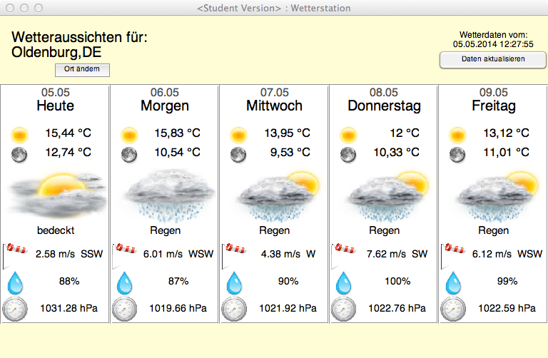

# Weather Station - eine Matlab Wettervorhersage

Dies ist die Matlab-Realisierung einer kleinen Wettervorhersage für fünf Tage. Die Wetterdaten stammen dabei von [Openweathermap](http://openweathermap.com). In einer kleinen Fenster werden für jeden Tag folgende Daten dargestellt:

+ Datum
+ Wochentag
+ Tagtemperatur
+ Nachttemperatur
+ aktuelle Bewölkung (Bild + Text)
+ Windgeschwindigkeit + Richtung
+ Luftfeuchtigkeit
+ Luftdruck

Der Nutzer hat die Möglichkeit den Ort zu wechseln oder die Daten zu aktualisieren. Außerdem erscheint ein kleiner Tooltip, wenn man den Mauszeiger über einem Wert lässt, der erklärt um welche Daten es sich handelt.

### Screenshot 
typisch Oldenburgisches Wetter... ;-)

## Motivation/Zielsetzung

Entstanden ist das Projekt innerhalb meines Studiums an der **Jade Hochschule Oldenburg** im Fach **Daten und Algorithmen** im SS 2014 als Programmieraufgabe. Mein persönlicher Fokus lag dabei vor allem auf der Art und Weise der Implementierung, nämlich, in Matlab eine Art **Model-View-Controller Design** zu realisieren, sowie mittels *nested functions* eine klassenähnliche Struktur zu schaffen, ohne *Matlabs* speicherhungriges OOP zu verwenden.

====================

## Installation/Start

Das Programm enthält alle erforderlichen Dateien und benötigt keine Installation. Zum Starten einfach die Datei `WS_START.m` mit Matlab ausführen. Alle Abhängigkeiten zu anderen Dateien und Funktionen werden automatisch hergestellt.

### Systemvoraussetzungen/Testumgebung
Entwickelt wurde das Programm unter OSX 10.9 mit Matlab R2013a (Student). Zum Ausführen reicht die Standardkonfiguration, es werden keine Toolboxen benötigt.

Testweise wurde die Software auch unter Windows und Matlab R2012a ausgeführt. Die prinzipielle Funktionalität bleibt dabei erhalten, allerdings ergeben sich durch Unterschiede bei der Darstellung von Fonts leichte Verschiebungen bzw. Verdeckungen in der GUI.

## Der Aufbau des Programms

Die Implementierung in Matlab versucht eine Berücksichtigung des **MVC Entwurfmusters** um Programmlogik und Darstellung voneinander zu trennen.

### Model

Als einziges Model fungiert die Datei `WeatherStationModel.m` im Ordner .inc/. Sie ist als "Quasiklasse" mit nested functions implementiert und gibt ein Handle mit allen verfügbaren Methoden zurück. Die Initialisierung erfolgt in der Datei `WS_START.m`, wobei als Parameter der Name der Stadt, für welche die Wettervorhersage erstellt werden soll, übergeben wird.

Die wichtigsten öffentlichen Methoden sind:

+ `updateStation()` - aktualisiert die Wetterdaten 
+ `changeStation(szNewCityName)` - wechselt den Ort
+  getter Methoden für alle Parameter (können der Matlab Datei entnommen werden)

### View

Als View dient die Funktion `WeatherStationGUI.m`. Sie baut die komplette GUI auf und gibt als Rückgabeparameter ein Struct mit allen Handles der erstellten Figure zurück.

### Controller

Die Controller Funktionen `WS_START.m`,`changeCity.m` und `updateGUI.m` bilden die Schnittstelle zwischen Model und View. Als Argumente werden ihnen grundsätzlich die Rückgabeparameter von Model und View übergeben (Ausnahme: `WS_START.m`). Als letzter Befehl jeder Controller Funktion wird die Funktion `updateGUI.m` aufgerufen, um die zuvor im Model geänderten Daten in der GUI zu aktualisieren.

Als Einstiegspunkt und quasi Maincontroller existiert die Datei `WS_START.m`, welche folgende Aufgaben übernimmt:

1. Hinzufügen aller benötigten Ressourcen zum Matlab Path
2. Initialisierung des Models mit dem Startort Oldenburg
3. Erstellen der leeren GUI
4. Daten in die GUI schreiben mittels Funktion `updateGUI.m`

Auch die Callbackfunktionen der beiden Buttons können als Controller verstanden werden.

+ `changeCity.m` - Funktion zum Wechseln der Stadt (Leichte Aufweichung des MVC, da hier auch das Dialogfenster zur Eingabe des neuen Ortes bereitgestellt wird.). 
+ `updateData.m` - Funktion zum aktualisieren der Wetterdaten für den aktuellen Standort.

## Weitere Dateien und Ordner

### externe Dateien

In das Projekt eingebunden ist mit freundlicher Genehmigung des Autors die externe Funktion `parse_xml.m`, welche das Parsen von XML-Dateien in Matlab stark vereinfacht und ein Struct mit allen XML Elementen bereitstellt.

### Icons

Die Wetter-Icons der GUI sind frei für nichtkommerzielle Projekte und stammen von [deviantart.com](http://vclouds.deviantart.com/art/VClouds-Weather-Icons-179152045).

### Wetterdaten

Die Wetterdaten werden über die [API](http://openweathermap.org/API) von *Open Weather Map* per XML-Download bezogen und jeweils im Ordner `./data` für jeden bereits abgerufenen Standort gespeichert. Um einen unnötigen Datentransfer zu verhindern, wird bei einem Standortwechsel zu einem bereits vorhandenen Standort nur ein Update der Daten vorgenommen, wenn die vorhandene Datei älter als fünf Stunden ist. Ein manuelles Update der Daten über die GUI erzwingt ein neues Abrufen der aktuellen Daten.

----------------

## Bugs

**\#1** (behoben in Version 1.1)

Ein bekanntes Problem des Programms in der Version 1.0 ist, dass es bei manchen Standorten zu Fehlern kommt, die sich nur schwer abfangen lassen. Dabei liegt die Ursache an der API von Open Weather Map, welche besonders bei Aufrufen von Standorten mit Umlauten fehlerhafte XML-Daten liefert. Der Fehler tritt dabei beim Parsen der XML-Datei mittels `parse_xml.m` auf, in der eine JAVA Exception geworfen wird.

**Beispiel:**

+ Die Stadt 'Fürth' wird nicht gefunden
+ Die Stadt 'Fuerth' wird gefunden und eine XML-Datei heruntergaladen, allerdings enthält der Tag `<name>F?rth</name>` ein invalides UTF-8 Zeichen, welches vermutlich den Fehler beim Parsen auslöst.

------------

**\#2**

In Version 1.1 müssen Umlaute in Standortnamen ausgeschrieben werden. (Bsp: ü = ue) Bug #1 ist dafür behoben und die Stadt "Fuerth" wird nun gefunden. Seltsam bleibt, dass nach Fuerth gesucht werden muss, dann aber Fürth als Name in der XML-datei steht. 

-----------

**\#3**

wie bereits unter "Installation/Start" aufgeführt, ist die Software in der Version 1.0 nicht plattformunabhängig einsetzbar. 

------------

## Copyright

Copyright (c) <2014> S.Volke
Institute for Hearing Technology and Audiology
Jade University of Applied Sciences 
Permission is hereby granted, free of charge, to any person obtaining 
a copy of this software and associated documentation files 
(the "Software"), to deal in the Software without restriction, including 
without limitation the rights to use, copy, modify, merge, publish, 
distribute, sublicense, and/or sell copies of the Software, and to
permit persons to whom the Software is furnished to do so, subject
to the following conditions:
The above copyright notice and this permission notice shall be included 
in all copies or substantial portions of the Software.

THE SOFTWARE IS PROVIDED "AS IS", WITHOUT WARRANTY OF ANY KIND, 
EXPRESS OR IMPLIED, INCLUDING BUT NOT LIMITED TO THE WARRANTIES 
OF MERCHANTABILITY, FITNESS FOR A PARTICULAR PURPOSE AND NONINFRINGEMENT. 
IN NO EVENT SHALL THE AUTHORS OR COPYRIGHT HOLDERS BE LIABLE FOR ANY 
CLAIM, DAMAGES OR OTHER LIABILITY, WHETHER IN AN ACTION OF CONTRACT, 
TORT OR OTHERWISE, ARISING FROM, OUT OF OR IN CONNECTION WITH THE 
SOFTWARE OR THE USE OR OTHER DEALINGS IN THE SOFTWARE.

